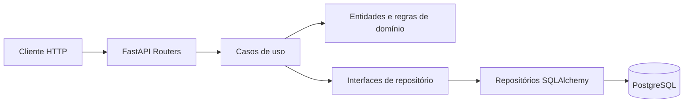
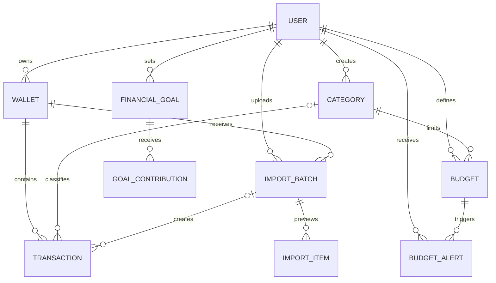

# Expense Tracker API

API REST de finanças pessoais construída como projeto de portfólio com FastAPI, PostgreSQL, SQLAlchemy e Clean Architecture.

O sistema oferece autenticação JWT, múltiplas carteiras, categorias, transações de receita e despesa, recorrências, importação CSV/OFX, conversão histórica de moedas, metas financeiras, orçamentos com alertas, inteligência financeira, dashboard e relatórios. Todos os recursos são isolados por usuário.

## Destaques técnicos

- 67 operações HTTP funcionais e documentadas com OpenAPI.
- Valores monetários armazenados como `NUMERIC(14, 2)` e manipulados com `Decimal`.
- Taxas de câmbio diárias armazenadas com precisão `NUMERIC(20, 10)`.
- Conversão histórica com cache local e integração substituível com o Frankfurter v2.
- Snapshot contábil de moeda, cotação e valor convertido em cada transação.
- Importação CSV, OFX 1.x/2.x e QFX com preview antes da confirmação.
- Deduplicação por carteira, origem e identificador bancário/fingerprint.
- Arquivos processados em memória e descartados após o parsing.
- Metas financeiras com progresso calculado, prazo, ciclo de vida e histórico de aportes.
- Conclusão automática da meta e bloqueio pessimista contra aportes concorrentes.
- Alertas preventivos e de orçamento excedido, deduplicados por período.
- Caixa de notificações com contagem, leitura e resolução automática após correções.
- Dashboard com visão mensal, patrimônio convertido, fluxo de caixa e distribuição por categoria.
- Projeções prontas para gráficos e componentes Flutter, incluindo meses sem movimentação.
- Atualização de saldo e lançamento financeiro dentro da mesma transação de banco.
- Bloqueio pessimista de carteira no PostgreSQL para evitar disputa de saldo.
- Proteção contra IDOR em carteiras, categorias, transações, orçamentos e relatórios.
- Exclusão de carteira implementada como arquivamento para preservar histórico financeiro.
- 95 testes automatizados: 94 isolados e um fluxo completo em PostgreSQL.
- Cobertura de código de 90%.
- Ruff, Mypy, Pytest, Coverage, pre-commit e GitHub Actions.
- Docker e Docker Compose para ambiente reproduzível.

## Stack

| Área | Tecnologia |
|---|---|
| Linguagem | Python 3.12–3.14 |
| API | FastAPI e Uvicorn |
| Validação | Pydantic v2 e pydantic-settings |
| ORM | SQLAlchemy 2.0 |
| Banco | PostgreSQL |
| Migrações | Alembic |
| Segurança | bcrypt e PyJWT |
| Câmbio | Frankfurter API v2 e cache PostgreSQL |
| Importação | CSV, python-multipart e ofxparse2 |
| Testes | Pytest, HTTPX e SQLite em memória |
| Qualidade | Ruff, Mypy e pytest-cov |
| Infraestrutura | Docker, Docker Compose e GitHub Actions |
| Dependências | Poetry |

## Arquitetura



```text
app/
├── domain/                  # Entidades, dinheiro e exceções de negócio
├── use_cases/               # Autenticação e regras de transação
│   └── interfaces/          # Contratos de persistência
├── interfaces/
│   ├── repositories/        # Adaptadores SQLAlchemy
│   └── schemas/             # Contratos Pydantic da API
└── infrastructure/
    ├── database/            # Engine e modelos relacionais
    ├── exchange_rates/      # Adaptador do provedor de cotações
    ├── imports/             # Parsers CSV/OFX sem armazenamento de arquivos
    ├── security/            # bcrypt e JWT
    └── web/                 # Dependências e routers FastAPI
```

## Modelo de dados



## Recursos da API

Todas as rotas de negócio usam o prefixo `/api/v1`.

| Recurso | Operações |
|---|---|
| Autenticação | Registrar e autenticar usuário |
| Usuários | Consultar e atualizar perfil, preferências financeiras, alterar senha e desativar conta |
| Carteiras | Criar, listar, consultar, atualizar e arquivar |
| Moedas | Listar moedas suportadas e consultar conversão histórica |
| Importações | Upload, histórico, preview, confirmação e descarte de CSV/OFX |
| Metas financeiras | CRUD, filtros por status e histórico de aportes |
| Categorias | CRUD completo |
| Transações | Criar, listar, consultar, atualizar, excluir e inserir em lote |
| Orçamentos | CRUD completo por categoria e período |
| Alertas de orçamento | Consumo atual, caixa de notificações, leitura e contagem |
| Dashboard | Visão geral, fluxo de caixa, gastos por categoria e transações recentes |
| Relatórios | Consolidado mensal e despesas por categoria |
| Sistema | Health check público em `/health` |

Documentação interativa:

- Swagger UI: `http://localhost:8000/docs`
- ReDoc: `http://localhost:8000/redoc`
- OpenAPI: `http://localhost:8000/openapi.json`

Os campos monetários são enviados como strings decimais, por exemplo `"125.50"`, evitando perda de precisão em JSON.

Cada usuário possui uma moeda-base e um fuso horário. Cada transação preserva o valor e a moeda originais, além da cotação e do valor convertido usados nos relatórios. Para evitar misturar bases contábeis, a moeda-base do usuário e a moeda da carteira ficam bloqueadas depois da primeira movimentação relacionada.

### Fluxo de importação

1. Envie um `.csv`, `.ofx` ou `.qfx` para `POST /api/v1/imports/` usando multipart com `wallet_id` e `file`.
2. Revise as linhas classificadas como `READY`, `DUPLICATE` ou `INVALID`.
3. Confirme o lote em `POST /api/v1/imports/{id}/confirm`, opcionalmente associando categorias ou ignorando linhas.

CSV usa detecção automática de delimitador e colunas comuns em português/inglês. Para layouts próprios, o campo multipart `options` aceita um objeto JSON com `date`, `description`, `amount` ou `debit`/`credit`, `type`, `id`, `delimiter` e `date_format`.

### Fluxo de metas financeiras

1. Crie uma meta em `POST /api/v1/goals/` com nome, valor-alvo e prazo opcional.
2. Registre economias em `POST /api/v1/goals/{id}/contributions`.
3. Acompanhe valor atual, restante e percentual diretamente na resposta da meta.
4. Ao atingir 100%, a meta passa automaticamente para `COMPLETED`.

As metas usam a moeda-base do usuário como snapshot e não alteram o saldo das carteiras. Um aporte representa o acompanhamento do valor reservado; movimentações bancárias continuam sendo registradas exclusivamente como transações.

### Alertas de orçamento

Cada orçamento pode definir `alert_threshold` entre 1% e 99% (80% por padrão) e controlar a emissão com `alerts_enabled`. Despesas manuais, em lote e importadas por CSV/OFX atualizam os alertas automaticamente.

- `WARNING`: consumo igual ou superior ao percentual preventivo configurado.
- `EXCEEDED`: consumo igual ou superior a 100% do limite.
- `GET /api/v1/budgets/status`: situação atual de todos os orçamentos.
- `GET /api/v1/budget-alerts/`: notificações ativas ou históricas.
- `GET /api/v1/budget-alerts/unread-count`: contador para badge no Flutter.
- `PATCH /api/v1/budget-alerts/{id}/read` e `POST /api/v1/budget-alerts/read-all`: controle de leitura.

Os alertas são únicos por orçamento, período e nível. Se uma despesa for corrigida ou removida, o alerta é marcado como resolvido; se o limite for cruzado novamente, ele é reativado como não lido.

### Dashboard para Flutter

Os endpoints retornam valores na moeda-base e estruturas diretamente consumíveis por cards, gráficos e listas:

- `GET /api/v1/dashboard/overview`: receitas, despesas, economia, patrimônio, metas, orçamentos e alertas.
- `GET /api/v1/dashboard/cash-flow`: série mensal de receitas, despesas e saldo, preenchendo meses vazios.
- `GET /api/v1/dashboard/spending-by-category`: ranking e percentual de participação de cada categoria.
- `GET /api/v1/dashboard/recent-transactions`: movimentações recentes enriquecidas com carteira e categoria.
- `GET /api/v1/dashboard/balance-projection`: projeção mensal do saldo a partir das recorrências ativas.
- `GET /api/v1/dashboard/period-comparison`: comparação de receitas, despesas e saldo com o mês anterior.
- `GET /api/v1/dashboard/financial-health`: nota de saúde financeira de 0 a 100 com métricas explicáveis.
- `GET /api/v1/dashboard/recommendations`: recomendações automáticas ordenadas por prioridade.

O patrimônio converte o saldo das carteiras para a moeda-base usando o mesmo cache histórico de cotações das transações. Períodos e agrupamentos respeitam o fuso horário configurado pelo usuário.

## Executando localmente com Poetry

Pré-requisitos: Python 3.12 ou superior, Poetry e uma instância PostgreSQL.

```bash
cp .env.example .env
poetry install
poetry run alembic upgrade head
poetry run uvicorn app.main:app --reload --port 8000
```

Antes de executar, substitua `DATABASE_URL` e `SECRET_KEY` no `.env`.

## Executando com Docker

```bash
docker compose up --build
```

O Compose disponibiliza a API na porta `8000` e o PostgreSQL na porta `5432`.

## Deploy gratuito na Render

O repositório inclui um [`render.yaml`](render.yaml) para criar um Web Service
Docker no plano gratuito. No Dashboard da Render, escolha **New > Blueprint**,
conecte este repositório e informe as variáveis secretas solicitadas:

- `DATABASE_URL`: connection string PostgreSQL completa, incluindo SSL;
- `CORS_ORIGINS`: lista JSON com as origens permitidas, por exemplo
  `["https://seu-app.onrender.com"]`.

A `SECRET_KEY` é gerada automaticamente pela Render e não deve ser copiada para
o repositório. O deploy acompanha a branch `main`, aguarda os checks do GitHub e
usa `/health` para confirmar que API e banco estão disponíveis. Antes de iniciar
o Uvicorn, o container executa `alembic upgrade head` de forma idempotente.

O servidor respeita a variável `PORT` fornecida pela plataforma e mantém a porta
`8000` como padrão local. Depois do primeiro deploy, valide:

```text
https://<nome-do-servico>.onrender.com/health
https://<nome-do-servico>.onrender.com/docs
```

### Cold start no plano gratuito

O serviço gratuito pode ser suspenso após um período sem tráfego. O aplicativo
cliente deve renderizar sua interface imediatamente e consultar `/health` em
segundo plano, com timeout e tentativas espaçadas. Enquanto a API inicia, mostre
um estado como “Preparando seu espaço financeiro”; não bloqueie a troca de tema
nem apresente o atraso como erro antes de encerrar as tentativas.

## Qualidade e testes

```bash
make lint
make typecheck
make coverage
```

Ou execute tudo:

```bash
make quality
```

Os testes rápidos usam SQLite em memória. A validação final de migrações e compatibilidade deve ser executada também contra PostgreSQL.

Para executar o teste integrado contra o PostgreSQL configurado:

```bash
RUN_POSTGRES_TESTS=1 poetry run pytest -m postgres
```

## Segurança

- Senhas nunca são armazenadas em texto puro.
- Tokens validam assinatura, expiração, emissor e audiência.
- Chaves e connection strings são fornecidas por variáveis de ambiente.
- A aplicação recusa as credenciais locais padrão quando executada em modo `production`.
- CORS é configurável por ambiente.
- Consultas de recursos são sempre limitadas ao usuário autenticado.

## Comandos úteis

```bash
make install      # instalar dependências
make run          # iniciar servidor local
make test         # executar testes
make coverage     # testes com cobertura
make lint         # análise Ruff
make format       # formatação Ruff
make typecheck    # verificação Mypy
```
