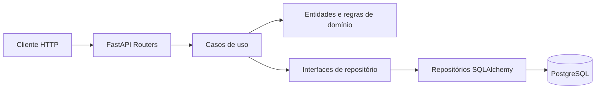
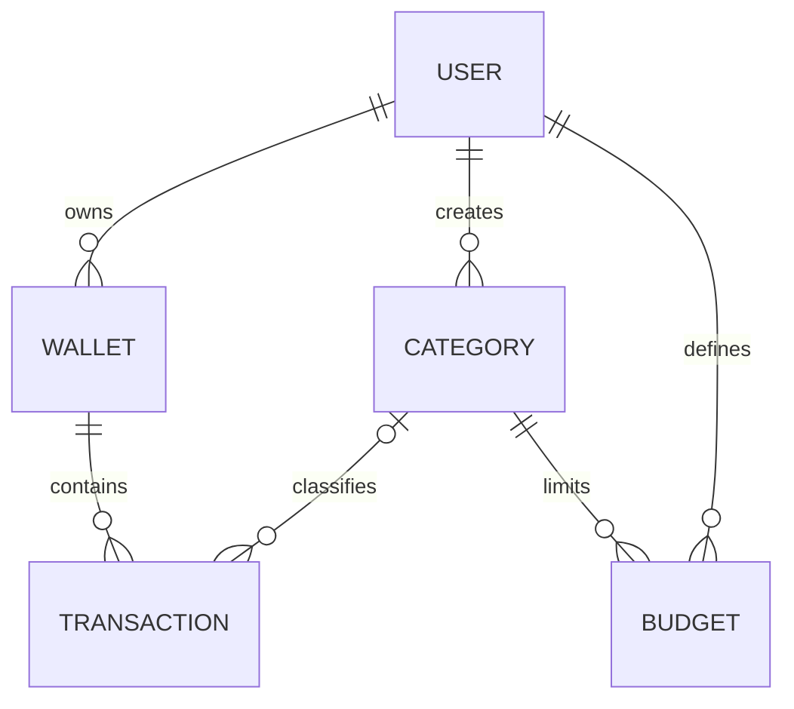

# Expense Tracker API

API REST de finanças pessoais construída como projeto de portfólio com FastAPI, PostgreSQL, SQLAlchemy e Clean Architecture.

O sistema oferece autenticação JWT, múltiplas carteiras, categorias, transações de receita e despesa, conversão histórica de moedas, orçamentos e relatórios financeiros. Todos os recursos são isolados por usuário.

## Destaques técnicos

- 33 operações HTTP funcionais e documentadas com OpenAPI.
- Valores monetários armazenados como `NUMERIC(14, 2)` e manipulados com `Decimal`.
- Taxas de câmbio diárias armazenadas com precisão `NUMERIC(20, 10)`.
- Conversão histórica com cache local e integração substituível com o Frankfurter v2.
- Snapshot contábil de moeda, cotação e valor convertido em cada transação.
- Atualização de saldo e lançamento financeiro dentro da mesma transação de banco.
- Bloqueio pessimista de carteira no PostgreSQL para evitar disputa de saldo.
- Proteção contra IDOR em carteiras, categorias, transações, orçamentos e relatórios.
- Exclusão de carteira implementada como arquivamento para preservar histórico financeiro.
- 57 testes automatizados: 56 isolados e um fluxo completo em PostgreSQL.
- Cobertura de código de 90%.
- Ruff, Mypy, Pytest, Coverage, pre-commit e GitHub Actions.
- Docker e Docker Compose para ambiente reproduzível.

## Stack

| Área | Tecnologia |
|---|---|
| Linguagem | Python 3.12–3.14 |
| API | FastAPI e Uvicorn |
| Validação | Pydantic v2 e pydantic-settings |
| ORM | SQLAlchemy 2.0 |
| Banco | PostgreSQL |
| Migrações | Alembic |
| Segurança | bcrypt e PyJWT |
| Câmbio | Frankfurter API v2 e cache PostgreSQL |
| Testes | Pytest, HTTPX e SQLite em memória |
| Qualidade | Ruff, Mypy e pytest-cov |
| Infraestrutura | Docker, Docker Compose e GitHub Actions |
| Dependências | Poetry |

## Arquitetura



```text
app/
├── domain/                  # Entidades, dinheiro e exceções de negócio
├── use_cases/               # Autenticação e regras de transação
│   └── interfaces/          # Contratos de persistência
├── interfaces/
│   ├── repositories/        # Adaptadores SQLAlchemy
│   └── schemas/             # Contratos Pydantic da API
└── infrastructure/
    ├── database/            # Engine e modelos relacionais
    ├── exchange_rates/      # Adaptador do provedor de cotações
    ├── security/            # bcrypt e JWT
    └── web/                 # Dependências e routers FastAPI
```

## Modelo de dados



## Recursos da API

Todas as rotas de negócio usam o prefixo `/api/v1`.

| Recurso | Operações |
|---|---|
| Autenticação | Registrar e autenticar usuário |
| Usuários | Consultar e atualizar perfil, preferências financeiras, alterar senha e desativar conta |
| Carteiras | Criar, listar, consultar, atualizar e arquivar |
| Moedas | Listar moedas suportadas e consultar conversão histórica |
| Categorias | CRUD completo |
| Transações | Criar, listar, consultar, atualizar, excluir e inserir em lote |
| Orçamentos | CRUD completo por categoria e período |
| Relatórios | Consolidado mensal e despesas por categoria |
| Sistema | Health check público em `/health` |

Documentação interativa:

- Swagger UI: `http://localhost:8000/docs`
- ReDoc: `http://localhost:8000/redoc`
- OpenAPI: `http://localhost:8000/openapi.json`

Os campos monetários são enviados como strings decimais, por exemplo `"125.50"`, evitando perda de precisão em JSON.

Cada usuário possui uma moeda-base e um fuso horário. Cada transação preserva o valor e a moeda originais, além da cotação e do valor convertido usados nos relatórios. Para evitar misturar bases contábeis, a moeda-base do usuário e a moeda da carteira ficam bloqueadas depois da primeira movimentação relacionada.

## Executando localmente com Poetry

Pré-requisitos: Python 3.12 ou superior, Poetry e uma instância PostgreSQL.

```bash
cp .env.example .env
poetry install
poetry run alembic upgrade head
poetry run uvicorn app.main:app --reload --port 8000
```

Antes de executar, substitua `DATABASE_URL` e `SECRET_KEY` no `.env`.

## Executando com Docker

```bash
docker compose up --build
```

O Compose disponibiliza a API na porta `8000` e o PostgreSQL na porta `5432`.

## Qualidade e testes

```bash
make lint
make typecheck
make coverage
```

Ou execute tudo:

```bash
make quality
```

Os testes rápidos usam SQLite em memória. A validação final de migrações e compatibilidade deve ser executada também contra PostgreSQL.

Para executar o teste integrado contra o PostgreSQL configurado:

```bash
RUN_POSTGRES_TESTS=1 poetry run pytest -m postgres
```

## Segurança

- Senhas nunca são armazenadas em texto puro.
- Tokens validam assinatura, expiração, emissor e audiência.
- Chaves e connection strings são fornecidas por variáveis de ambiente.
- A aplicação recusa as credenciais locais padrão quando executada em modo `production`.
- CORS é configurável por ambiente.
- Consultas de recursos são sempre limitadas ao usuário autenticado.

## Comandos úteis

```bash
make install      # instalar dependências
make run          # iniciar servidor local
make test         # executar testes
make coverage     # testes com cobertura
make lint         # análise Ruff
make format       # formatação Ruff
make typecheck    # verificação Mypy
```
